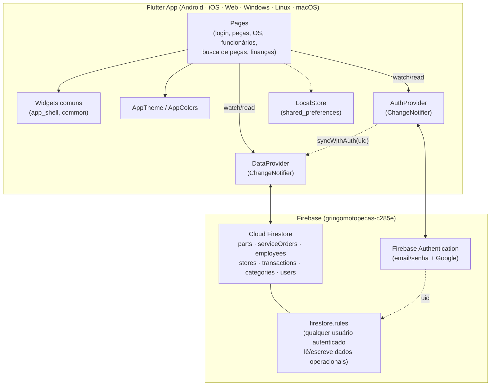

# 03 — Arquitetura

## Visão geral da arquitetura

O GMP Gestor é um app **Flutter puramente cliente**, sem backend próprio: não
há servidor de aplicação, API REST/GraphQL, nem banco de dados operado pela
equipe. Toda a persistência e autenticação são delegadas a serviços gerenciados
do **Firebase** (BaaS — Backend as a Service):

- **Firebase Authentication** — cadastro/login por email+senha e Google.
- **Cloud Firestore** — banco de dados NoSQL de documentos, com listeners em
  tempo real (`snapshots()`), usado tanto para leitura quanto escrita.

A UI segue o padrão **MVVM simplificado com `provider`**: os "ViewModels" são
dois `ChangeNotifier` globais (`AuthProvider` e `DataProvider`), injetados na
árvore de widgets via `MultiProvider` em `lib/main.dart`, e consumidos pelas
páginas com `context.watch`/`context.read`.

```
┌───────────────────────────────────────────────────────────┐
│                        Flutter App                        │
│                                                             │
│  Pages (UI)  ←── watch/read ──  Providers (estado)         │
│  login_page, parts_management_page, service_orders_page,   │
│  employees_page, search_parts_page, finances_page          │
│         │                              │                   │
│         │                    ┌─────────┴─────────┐         │
│         │                    │  AuthProvider      │         │
│         │                    │  DataProvider      │         │
│         │                    └─────────┬─────────┘         │
└─────────┼──────────────────────────────┼───────────────────┘
          │                              │
          ▼                              ▼
  ┌───────────────┐            ┌───────────────────┐
  │ Firebase Auth  │            │  Cloud Firestore   │
  │ (email/senha,  │            │ (parts, service    │
  │  Google)       │            │ Orders, employees,  │
  │                │            │ stores,             │
  │                │            │ transactions,       │
  │                │            │ categories, users)  │
  └───────────────┘            └───────────────────┘
```

## Componentes do sistema

| Componente | Arquivo | Responsabilidade |
| --- | --- | --- |
| `MotoGestApp` / `_Root` | `lib/main.dart` | Bootstrap do Firebase, injeção dos providers, roteamento por estado de login (login → verificação de email → home). |
| `AuthProvider` | `lib/services/auth_provider.dart` | Encapsula o Firebase Authentication: login, cadastro, Google Sign-In, logout, verificação de email. |
| `DataProvider` | `lib/services/data_provider.dart` | Mantém o estado local (cache) de peças, OS, funcionários, lojas, transações e categorias; abre/fecha listeners do Firestore conforme o usuário logado muda. |
| `LocalStore` | `lib/services/local_store.dart` | Wrapper fino sobre `shared_preferences` para persistência local leve (chave/valor e JSON). |
| Modelos | `lib/models/models.dart` | Classes imutáveis com `fromJson`/`toJson`, espelhando os documentos do Firestore. |
| Páginas | `lib/pages/*.dart` | Uma tela por arquivo; cada uma consome `DataProvider`/`AuthProvider` e dispara ações de escrita através deles. |
| Widgets comuns | `lib/widgets/common.dart`, `lib/widgets/app_shell.dart` | Componentes reutilizados entre telas (badges, cards de estatística, cabeçalho de página, diálogo padrão, barra de navegação). |
| Tema | `lib/theme/app_theme.dart` | Paleta de cores e `ThemeData` únicos do app. |
| Formatadores | `lib/utils/input_formatters.dart` | Máscaras de entrada (CPF, telefone, moeda) reaproveitadas nos formulários. |

## Como os componentes se comunicam

1. **UI → Provider**: as páginas chamam métodos como
   `context.read<DataProvider>().addPart(part)` para disparar uma escrita, e
   leem o estado atual com `context.watch<DataProvider>().parts` para
   reconstruir a UI reativamente.
2. **Provider → Firebase**: `DataProvider` mantém uma referência de coleção
   por entidade (`_partsRef`, `_ordersRef` etc.) e chama `set()`/`delete()`
   diretamente no SDK do Firestore. Não existe camada de repositório
   intermediária além do próprio `DataProvider`.
3. **Firebase → Provider**: cada coleção tem um listener
   (`_partsRef.snapshots().listen(...)`) que atualiza a lista local em
   memória e chama `notifyListeners()` sempre que o Firestore emite um novo
   snapshot — seja por uma escrita local ou de **outro dispositivo/usuário**.
4. **AuthProvider → DataProvider**: quando o usuário autenticado muda
   (login, logout, troca de conta), o `ChangeNotifierProxyProvider` em
   `main.dart` chama `DataProvider.syncWithAuth(uid)`, que cancela os
   listeners antigos, limpa o cache local e recria os listeners para o novo
   usuário (ou os mantém vazios se `uid == null`).
5. **Transações sintéticas**: `DataProvider.transactionsOf(storeId)` não é
   um listener — é uma função pura que combina as transações reais em cache
   com as calculadas a partir de `orders` (OS concluídas) no momento da
   chamada, sempre que a UI é reconstruída.

## Tecnologias utilizadas

| Camada | Tecnologia | Versão (pubspec.yaml) |
| --- | --- | --- |
| Framework | Flutter / Dart | SDK Dart `>=3.3.0 <4.0.0` |
| Gerenciamento de estado | `provider` | `^6.1.2` |
| Autenticação | `firebase_auth` | `^6.5.2` |
| Banco de dados | `cloud_firestore` | `^6.5.0` |
| Inicialização Firebase | `firebase_core` | `^4.10.0` |
| Login social | `google_sign_in` | `^7.2.0` |
| Gráficos | `fl_chart` | `^0.69.0` |
| Seleção de imagem | `image_picker` | `^1.1.2` |
| Persistência local leve | `shared_preferences` | `^2.3.2` |
| Internacionalização/formatos | `intl` | `^0.20.2` |
| Ícones do app | `flutter_launcher_icons` (dev) | `^0.14.4` |
| Lint | `flutter_lints` (dev) | `^4.0.0` |

## Diagrama da arquitetura



## Bancos de dados e serviços externos

| Serviço | Uso |
| --- | --- |
| **Cloud Firestore** | Único banco de dados do sistema. Modelo de documentos, sem schema fixo imposto pelo banco (a tipagem é garantida apenas no lado Dart, via `fromJson`/`toJson`). Ver [05-banco-de-dados.md](05-banco-de-dados.md). |
| **Firebase Authentication** | Único provedor de identidade. Suporta email/senha e Google. Não há SSO corporativo, MFA ou outros provedores (Facebook, Apple etc.). |
| **Google Sign-In (`google_sign_in`)** | Usado apenas como camada de obtenção de credencial Google no mobile/desktop; na web, o login Google usa o popup nativo do `firebase_auth` (`signInWithPopup`), sem depender do pacote `google_sign_in`. |
| **Firebase project** | `gringomotopecas-c285e` — único projeto, sem separação de ambientes (ver [10-deploy.md](10-deploy.md)). |

Não há filas de mensagens, cache distribuído, serviço de storage de objetos
(Firebase Storage, S3) nem qualquer outro serviço externo integrado.
