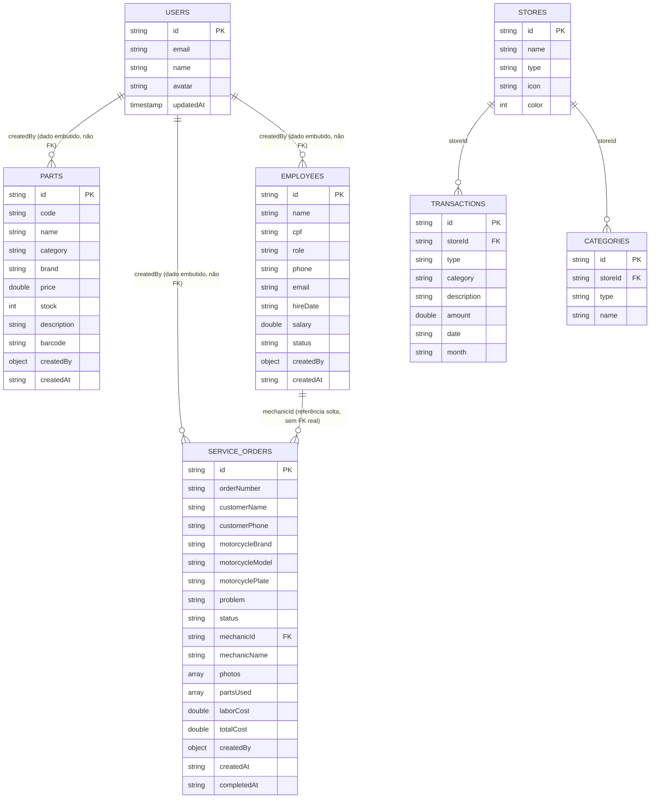

# 05 — Banco de Dados

O banco de dados é o **Cloud Firestore** (NoSQL orientado a documentos),
projeto Firebase `gringomotopecas-c285e`. Não há schema imposto pelo próprio
banco — a "tipagem" existe apenas no lado Dart, via `fromJson`/`toJson` em
`lib/models/models.dart`. Não há um ORM nem uma ferramenta de migração
formal.

## Modelo/diagrama do banco

> O Firestore não impõe chaves estrangeiras. As relações acima são
> **convenções de aplicação**: `storeId`, `mechanicId` e `createdBy` são
> apenas campos de texto/objeto sem qualquer validação de integridade
> referencial pelo banco.

## Tabelas (coleções) e relacionamentos

| Coleção | Documento (id) | Relacionamento |
| --- | --- | --- |
| `parts` | id próprio da peça | `createdBy` embute uma cópia (`id`, `name`, `email`) do usuário que criou — não é uma referência viva ao documento `users/{uid}`. |
| `serviceOrders` | id próprio da OS | `mechanicId` referencia (por convenção, sem FK) o `id` de um documento em `employees`; `partsUsed[].partId` referencia (também sem FK) um `id` em `parts`, mas **não é usado por nenhuma tela hoje** (ver [15-pendencias.md](15-pendencias.md)). |
| `employees` | id próprio do funcionário | Nenhuma referência de saída; é referenciado por `serviceOrders.mechanicId`. |
| `stores` | id próprio da loja (`motogest` para a loja padrão; `store-<timestamp>` para as demais) | Referenciada por `transactions.storeId` e `categories.storeId`. |
| `transactions` | id próprio (timestamp em ms) | `storeId` associa a transação a uma loja. Transações derivadas de OS concluída **não são documentos** — são calculadas em runtime (id sintético `os-<orderId>`, nunca persistido). |
| `categories` | id próprio (timestamp em ms) | `storeId` + `type` (`entrada`/`saida`) definem o escopo de unicidade do `name`. |
| `users` | uid do Firebase Auth | Espelha o perfil do usuário autenticado; não referenciado por outras coleções (o vínculo com `createdBy` é uma cópia de dados, não uma referência). |

## Campos importantes

### `parts` (mapeado por `MotorcyclePart`)

| Campo | Tipo | Observação |
| --- | --- | --- |
| `code`, `name`, `category`, `brand` | string | `category` é restrita na UI a uma lista fixa (`partCategories` em `parts_management_page.dart`): Motor, Freios, Suspensão, Transmissão, Elétrica, Carroceria, Escapamento, Filtros, Outras. |
| `price` | double | Formatado/entrado como moeda BRL. |
| `stock` | int | Determina os badges de estoque (ver regra de negócio em [02-requisitos.md](02-requisitos.md)). |
| `description`, `barcode` | string? | Opcionais; `barcode` não tem nenhuma tela de leitura/escrita hoje (campo do modelo sem uso na UI). |
| `createdBy` | `Creator` | `{id, name, email}` do usuário logado no momento da criação (não atualizado em edições subsequentes). |
| `createdAt` | string (ISO 8601) | Gerado no cliente (`DateTime.now().toIso8601String()`), não pelo servidor. |

### `serviceOrders` (mapeado por `ServiceOrder`)

| Campo | Tipo | Observação |
| --- | --- | --- |
| `status` | string | Um de `pending`, `in-progress`, `completed`, `cancelled`. |
| `photos` | `List<String>` | Cada item é uma **data URL base64** (`data:image/png;base64,...`, na web) ou um **caminho de arquivo local** (mobile/desktop) — nunca uma URL de um serviço de storage. Limite de 3 itens aplicado só na UI. |
| `partsUsed` | `List<PartUsed>` | `{partId, partName, quantity, price}`; o modelo existe mas **nenhum formulário atual popula esse campo** — é sempre `[]` para OS criadas pela UI hoje. |
| `laborCost`, `totalCost` | double | `totalCost` é digitado manualmente no formulário (não é calculado automaticamente a partir de `laborCost` + `partsUsed`). |
| `completedAt` | string? (ISO 8601) | Preenchido quando `status` vira `completed`; usado para determinar o `month` da transação sintética. |

### `employees` (mapeado por `Employee`)

| Campo | Tipo | Observação |
| --- | --- | --- |
| `role` | string | Um de `mechanic`, `attendant`, `manager`, `cashier`. |
| `status` | string | `active` ou `inactive`. |
| `cpf`, `phone` | string | Armazenados já formatados com máscara (o valor exibido no `TextEditingController` é o que é salvo). |
| `hireDate` | string (`yyyy-MM-dd`) | Apenas data, sem hora. |

### `stores` (mapeado por `BusinessStore`)

| Campo | Tipo | Observação |
| --- | --- | --- |
| `id` | string | `motogest` é o id fixo da loja padrão (criada por `DataProvider._ensureDefaultStore` se ainda não existir ao logar). |
| `color` | int | Valor ARGB (`Color.value`) usado para colorir o card da loja. |

### `transactions` (mapeado por `Transaction`)

| Campo | Tipo | Observação |
| --- | --- | --- |
| `type` | string | `entrada` ou `saida`. |
| `date` | string (`yyyy-MM-dd`) | Data do lançamento. |
| `month` | string (`yyyy-MM`) | Derivado de `date`; usado para os filtros/agrupamentos mensais (evita reparsear `date` toda vez). |
| `storeId` | string | Gravado fora do `toJson()` do modelo — é adicionado manualmente em `DataProvider.addTransaction`. |

### `categories` (mapeado por `FinanceCategory`)

| Campo | Tipo | Observação |
| --- | --- | --- |
| `storeId`, `type`, `name` | string | Chave de unicidade lógica é `(storeId, type, name.toLowerCase())`, verificada apenas no cliente. |

### `users`

| Campo | Tipo | Observação |
| --- | --- | --- |
| `id`, `email`, `name`, `avatar` | string | Espelho do perfil do Firebase Auth. |
| `updatedAt` | timestamp (server) | Único campo do banco todo que usa `FieldValue.serverTimestamp()` — todos os demais timestamps são gerados no cliente. |

## Índices

`firestore.indexes.json` está **vazio** (`{"indexes": [], "fieldOverrides": []}`).
Não há índices compostos definidos. As únicas queries com filtro
(`where('storeId', isEqualTo: ...)` em `DataProvider.deleteStore` e
`DataProvider.renameCategory`) são de campo único, cobertas pelos índices
automáticos do Firestore — por isso nenhum índice composto foi necessário até
agora. Se uma tela futura precisar filtrar por múltiplos campos + ordenar,
será necessário declarar o índice aqui (e reimplantar, ver
[10-deploy.md](10-deploy.md)).

## Regras de integridade

Toda a integridade é responsabilidade do **cliente Flutter** — o Firestore em
si não valida schema, tipos, obrigatoriedade de campos ou relacionamentos.
Pontos relevantes:

- **Nenhuma validação de servidor**: `firestore.rules` só checa
  autenticação (`request.auth != null`), nunca a forma dos dados
  (`request.resource.data`). Um cliente malicioso autenticado poderia gravar
  um documento com campos ausentes ou tipos errados.
- **IDs gerados no cliente**: colisão de `id` é teoricamente possível (dois
  dispositivos criando um registro no mesmo milissegundo), embora
  extremamente improvável na prática.
- **Duplicidade de categoria**: verificada apenas em memória, no momento da
  criação — uma condição de corrida entre dois usuários criando a mesma
  categoria simultaneamente não é impedida pelo banco.
- **Cascata de exclusão de loja**: implementada manualmente em
  `DataProvider.deleteStore` via `WriteBatch` (não é uma cascata nativa do
  Firestore) — lê todas as transações/categorias da loja e as apaga no mesmo
  batch da remoção da loja.
- **Consistência das transações sintéticas de OS**: não é preciso lógica de
  integridade adicional porque essas transações nunca são persistidas — são
  sempre recalculadas a partir do estado atual de `orders`.

## Migrations (alterações versionadas no banco)

**Não existe um mecanismo formal de migrations** (não há Firestore
migrations, nem scripts versionados de alteração de schema). Mudanças de
schema até hoje foram feitas por:

- Alterar `fromJson`/`toJson` em `models.dart` com campos opcionais
  (`String?`) para tolerar documentos antigos sem o campo novo — ex.:
  `emailVerified` no `User` com default `false`, `photos`/`partsUsed` com
  fallback para lista vazia em `ServiceOrder.fromJson`.
- A única "migração de dados em produção" documentada no código é a
  migração de categoria: `DataProvider.renameCategory` atualiza em lote as
  transações existentes que referenciavam o nome antigo da categoria.

Se o projeto crescer, recomenda-se formalizar um diretório de scripts de
migração (ex.: `scripts/migrations/`) executados manualmente contra o
Firestore antes de cada release que mude o formato de um documento — ver
[15-pendencias.md](15-pendencias.md).
